# SessionBox - AI 上下文文档

## 变更记录 (Changelog)

| 时间 | 操作 | 说明 |
|------|------|------|
| 2026-04-17 18:08:25 | 增量更新 | 大幅更新：新增 AI 聊天/Agent 系统（ai-proxy/langchain/工具发现/MCP Server/Chat DB）、插件系统（PluginManager/PluginContext/PluginStorage/PluginEventBus）、工作流编辑器（WorkflowEngine/NodeRegistry/版本控制/执行日志）、网络嗅探器、密码管理、搜索引擎配置、命令面板、Favicon 缓存、页面内容提取（Readability/Turndown）、技能系统（Skill Store）、数据迁移到 JsonStore、21 个 Pinia Store 等 |
| 2026-04-13 10:44:52 | 增量更新 | 全面更新文档：新增工作区/容器/页面模型、分屏、下载管理、扩展、自动更新、托盘、快捷键、书签导入导出/健康检查、主题预设、历史记录、Dexie 等 |
| 2026-04-09 02:12:31 | 初始化 | 首次生成项目 AI 上下文，覆盖全部源码文件 |

---

## 项目愿景

SessionBox 是一个基于 Electron + Vue 3 的**多账号浏览器管理工具**。核心目标是让用户在同一个桌面应用内，通过 `partition` 隔离不同账号的 Cookie/Session，同时支持分组管理、代理配置、标签页拖拽排序、常用网站快捷访问、分屏视图、Chrome 扩展、Aria2 下载管理、AI 智能助手（Agent/Chat）、可视化工作流编排、MCP Server、插件系统等功能。典型使用场景包括：社交媒体多账号运营、电商多店铺管理、多身份浏览、浏览器自动化等。

---

## 架构总览

本项目采用经典的 **Electron 三进程架构**（主进程 / 预加载 / 渲染进程），构建工具链为 **electron-vite**。

- **主进程 (electron/)**：负责窗口管理、WebContentsView 生命周期、IPC 通信（25+ IPC 模块）、数据持久化（electron-store + JsonStore）、代理配置、自定义协议、Chrome 扩展加载、Aria2 下载管理、系统托盘、自动更新、全局快捷键、标签冻结、AI 代理网关（API Key 安全中转、SSE 流解析、工具执行循环）、MCP Server、插件管理、工作流存储、密码管理、书签存储、Favicon 缓存、页面内容提取等
- **预加载 (preload/)**：通过 `contextBridge` 暴露类型安全的 IPC API 给渲染进程，包含 25+ 命名空间
- **渲染进程 (src/)**：Vue 3 + Pinia 状态管理（21 个 Store） + Tailwind CSS 4 + Radix Vue/shadcn-vue 组件库 + Dexie(IndexedDB) 本地历史/聊天记录 + Vue Flow 工作流编辑器 + Agent 工具发现系统

数据流向：
- **常规 IPC**：渲染进程 `window.api.*` -> 预加载桥接 -> 主进程处理 -> electron-store/JsonStore 持久化
- **AI 聊天**：渲染进程构造请求 -> `chat:completions` IPC -> 主进程 ai-proxy 注入 API Key -> SSE 流转发 -> 渲染进程实时渲染（支持 tool_use 多轮循环）
- **插件事件**：IPC handle 包装层广播 `ipc:{channel}` 事件 -> pluginEventBus -> 插件监听
- **主进程推送**：webContents.send -> 渲染进程 Store/组件监听

---

## 模块结构图 (Mermaid)

```mermaid
graph TD
    ROOT["SessionBox (根)"] --> ELECTRON["electron/ (主进程)"]
    ROOT --> PRELOAD["preload/ (预加载)"]
    ROOT --> SRC["src/ (渲染进程)"]
    ROOT --> RESOURCES["resources/"]
    ROOT --> SCRIPTS["scripts/"]
    ROOT --> DOCS["docs/"]

    ELECTRON --> EI["electron/ipc (25+ 模块)"]
    ELECTRON --> ES["electron/services"]
    ELECTRON --> EU["electron/utils"]
    ELECTRON --> EC["electron/composables"]

    ES --> ES_AI["ai-proxy (AI 代理网关)"]
    ES --> ES_MCP["mcp/ (MCP Server)"]
    ES --> ES_PLUGIN["plugin-* (插件系统)"]
    ES --> ES_WF["workflow-* (工作流存储)"]
    ES --> ES_BM["bookmark-store"]
    ES --> ES_PW["password-store"]
    ES --> ES_SK["skill-store"]
    ES --> ES_FC["favicon-cache"]
    ES --> ES_PE["page-extractor"]
    ES --> ES_EL["execution-log"]
    ES --> ES_MG["migration"]

    SRC --> SC["src/components"]
    SRC --> SS["src/stores (21 个)"]
    SRC --> SLIB["src/lib"]
    SRC --> SCOMP["src/composables"]
    SRC --> STYPES["src/types"]

    SC --> SC_UI["components/ui (shadcn)"]
    SC --> SC_SIDEBAR["components/sidebar"]
    SC --> SC_TABS["components/tabs"]
    SC --> SC_TOOLBAR["components/toolbar"]
    SC --> SC_BOOKMARK["components/bookmarks"]
    SC --> SC_SETTINGS["components/settings"]
    SC --> SC_DOWNLOAD["components/download"]
    SC --> SC_HISTORY["components/history"]
    SC --> SC_CHAT["components/chat"]
    SC --> SC_WORKFLOW["components/workflow"]
    SC --> SC_PLUGINS["components/plugins"]
    SC --> SC_PASSWORDS["components/passwords"]
    SC --> SC_COMMAND["components/command-palette"]
    SC --> SC_COMMON["components/common"]

    SLIB --> SLIB_AGENT["lib/agent"]
    SLIB --> SLIB_WF["lib/workflow"]
    SLIB --> SLIB_DB["lib/db + chat-db"]

    click ELECTRON "./electron/CLAUDE.md" "查看主进程模块文档"
    click SRC "./src/CLAUDE.md" "查看渲染进程模块文档"
    click PRELOAD "./preload/CLAUDE.md" "查看预加载模块文档"
```



---

## 模块索引

| 模块路径 | 语言 | 职责 | 入口文件 | 测试 | 文档 |
|----------|------|------|----------|------|------|
| `electron/` | TypeScript | 主进程：窗口、IPC、数据存储、WebView 管理、代理、扩展、下载、托盘、更新、快捷键、AI 代理、MCP Server、插件系统、工作流存储、密码管理、Favicon 缓存 | `electron/main.ts` | 无 | [CLAUDE.md](./electron/CLAUDE.md) |
| `preload/` | TypeScript | 预加载脚本：contextBridge 暴露 IPC API（25+ 命名空间） | `preload/index.ts` | 无 | [CLAUDE.md](./preload/CLAUDE.md) |
| `src/` | TypeScript + Vue | 渲染进程：UI 组件、21 个 Pinia Store、Agent/Chat、工作流编辑器、Dexie 历史记录 | `src/main.ts` | 无 | [CLAUDE.md](./src/CLAUDE.md) |
| `scripts/` | JavaScript | 构建/打包脚本、插件服务器、插件构建 | `scripts/build-production.js` | 无 | - |
| `resources/` | 静态资源 | 应用图标、托盘图标、示例插件 | - | - | - |
| `docs/` | Markdown | 设计文档、功能规划（含 AI/Agent/MCP/工作流/命令面板等） | - | - | - |

---

## 运行与开发

### 前置条件

- Node.js（推荐 LTS 版本）
- pnpm 包管理器

### 常用命令

```bash
# 开发模式（热重载）
pnpm dev

# 构建（编译主进程 + 预加载 + 渲染进程）
pnpm build

# 预览构建结果
pnpm preview

# 生产打包（含 electron-builder）
pnpm pack

# 发布打包
pnpm pack:release

# 仅打包目录（不生成安装包）
pnpm pack:dir
```

### 构建配置

- **Vite 配置**：`electron.vite.config.ts` -- 定义了 main/preload/renderer 三个构建入口
- **Electron Builder**：`electron-builder.json` -- 定义 DMG（Mac）/ NSIS（Windows）打包参数
- **TypeScript**：`tsconfig.json` + `tsconfig.node.json` + `tsconfig.web.json`

### 数据存储

- **electron-store**：将结构化数据持久化为 JSON 文件，存储在用户数据目录
  - 核心数据模型：`workspaces`、`groups`、`containers`、`pages`、`proxies`、`tabs`、`extensions`、`containerExtensions`
  - 配置数据：`windowState`、`tabFreezeMinutes`、`shortcuts`、`mutedSites`、`splitStates`、`splitSchemes`、`trayWindowSizes`、`aiProviders`、`searchEngines`、`snifferDomains`、`defaultContainerId`、`defaultWorkspaceId`、`defaultSearchEngineId`、`minimizeOnClose`、`askContainerOnOpen`、`updateSource`、`mcpEnabled`
- **JsonStore（独立 JSON 文件）**：
  - `bookmark-store.json`：书签和书签文件夹（从 electron-store 迁移）
  - `password-store.json`：密码/笔记条目（从 electron-store 迁移）
  - `workflow-folders.json`：工作流文件夹索引
  - `workflows/{id}.json`：每个工作流独立文件
  - `workflow-data/workflow-versions.json`：工作流版本快照
  - `workflow-data/execution-logs.json`：工作流执行日志
  - `plugin-data/disabled.json`：已禁用插件列表
  - `plugin-data/{pluginId}/storage.json`：每个插件的独立存储
- **Dexie (IndexedDB)**：
  - `sessionbox-history`：浏览历史记录，最多 10000 条
  - `sessionbox-chat`：AI 聊天会话和消息，每个会话最多 5000 条
- **Skill Store**：`{userData}/skills/` 目录，每个 Skill 为 Markdown 文件（含 frontmatter）
- **Favicon Cache**：`{userData}/site-icons/` 目录，域名映射到本地图标文件
- **localStorage**：主题、工作区视图、标签栏布局、主页设置、用户头像等轻量配置
- 账号图标保存在 `{userData}/account-icons/` 目录
- 容器图标保存在 `{userData}/container-icons/` 目录
- AI 截图保存在 `{userData}/ai-screenshots/` 目录

### 自定义协议

- `sessionbox://openContainer?id={containerId}` -- 深度链接，用于桌面快捷方式直接打开页面
- `account-icon://{filename}` -- 账号自定义图标加载协议
- `extension-icon://{extensionId}` -- 扩展图标加载协议
- `site-icon://{domain}` -- 网站图标加载协议（本地缓存 + 自动下载）
- `screenshot://{filename}` -- AI 截图加载协议

### 默认浏览器功能

- 支持注册为系统默认浏览器（http/https 协议处理器）
- 外部 http/https 链接会在主窗口当前标签页中打开

---

## 测试策略

当前项目**未配置测试框架**，无单元测试、集成测试或 E2E 测试文件。

---

## 编码规范

- **语言**：TypeScript（主进程/预加载/渲染进程均使用 TS）
- **UI 组件**：Vue 3 Composition API (`<script setup lang="ts">`)
- **样式**：Tailwind CSS 4 + CSS 变量主题系统（6 种预设主题：默认/Apple/Google/Tesla/Spotify/NVIDIA）
- **组件库**：基于 Radix Vue / reka-ui 的 shadcn-vue 组件
- **图标**：lucide-vue-next（含动态图标解析器 `lucide-resolver.ts`）
- **状态管理**：Pinia（Composition API 风格），21 个 Store
- **本地数据库**：Dexie (IndexedDB) 用于浏览历史和 AI 聊天记录
- **IPC 通信**：通过 preload 桥接，类型定义在 `preload/index.ts`、`src/types/index.ts`、`electron/services/store.ts` 三处保持同步
- **拖拽排序**：vuedraggable 库（分组/标签页）+ 自定义拖拽协议（书签文件夹/书签）
- **下载管理**：Aria2 RPC 通信，内置 aria2c 二进制（Windows）
- **扩展管理**：electron-chrome-extensions 库，按 partition 隔离加载
- **AI 代理**：主进程 ai-proxy 安全中转 API Key，支持 Anthropic Messages API SSE 流 + tool_use 多轮循环
- **MCP Server**：基于 @modelcontextprotocol/sdk，SSE 传输，默认端口 9527
- **工作流编辑器**：Vue Flow 可视化编辑 + 自定义引擎执行
- **插件系统**：基于 EventEmitter2 事件总线，支持 JS 沙箱、独立存储、生命周期管理

---

## AI 使用指引

### 项目结构导航

1. 需要修改 **UI 界面** -> 看 `src/components/` 和 `src/stores/`
2. 需要修改 **数据处理或持久化** -> 看 `electron/services/store.ts`（electron-store）或 `electron/services/*-store.ts`（JsonStore）
3. 需要修改 **IPC 通信接口** -> 同时修改 `preload/index.ts`、`electron/ipc/`、`src/types/index.ts`
4. 需要修改 **WebView/标签页行为** -> 看 `electron/services/webview-manager.ts` 和 `src/stores/tab.ts`
5. 需要修改 **代理功能** -> 看 `electron/services/proxy.ts` 和 `electron/ipc/proxy.ts`
6. 需要添加 **新数据模型** -> 同步修改 `src/types/index.ts`、`electron/services/store.ts`、`preload/index.ts`
7. 需要修改 **分屏功能** -> 看 `src/stores/split.ts`、`src/lib/split-layout.ts`、`electron/ipc/split.ts`
8. 需要修改 **下载功能** -> 看 `electron/services/aria2.ts`、`electron/ipc/download.ts`、`src/stores/download.ts`
9. 需要修改 **扩展功能** -> 看 `electron/services/extensions.ts`、`electron/ipc/extensions.ts`
10. 需要修改 **托盘功能** -> 看 `electron/services/tray.ts`、`electron/services/tray-window.ts`
11. 需要修改 **快捷键** -> 看 `electron/services/shortcut-manager.ts`、`src/stores/shortcut.ts`
12. 需要修改 **历史记录** -> 看 `src/lib/db.ts`、`src/stores/history.ts`
13. 需要修改 **AI 聊天/Agent** -> 看 `electron/services/ai-proxy.ts`、`electron/ipc/chat.ts`、`src/lib/agent/`、`src/stores/chat.ts`、`src/components/chat/`
14. 需要修改 **MCP Server** -> 看 `electron/services/mcp/`、`electron/ipc/mcp.ts`、`src/stores/mcp.ts`
15. 需要修改 **插件系统** -> 看 `electron/services/plugin-manager.ts`、`electron/ipc/plugin.ts`、`src/stores/plugin.ts`、`src/components/plugins/`
16. 需要修改 **工作流编辑器** -> 看 `src/lib/workflow/`、`src/components/workflow/`、`src/stores/workflow.ts`、`electron/services/workflow-store.ts`、`electron/ipc/workflow.ts`
17. 需要修改 **密码管理** -> 看 `electron/services/password-store.ts`、`src/components/passwords/`、`src/stores/password.ts`
18. 需要修改 **网络嗅探** -> 看 `electron/ipc/sniffer.ts`、`src/stores/sniffer.ts`、`src/components/common/SnifferMiniPopover.vue`
19. 需要修改 **命令面板** -> 看 `src/composables/useCommandPalette.ts`、`src/components/command-palette/`、`src/types/command.ts`
20. 需要修改 **技能系统** -> 看 `electron/services/skill-store.ts`、`src/lib/agent/tools.ts`
21. 需要修改 **页面内容提取** -> 看 `electron/services/page-extractor.ts`

### 关键注意事项

- **数据模型三处同步**：`src/types/index.ts`、`electron/services/store.ts`、`preload/index.ts` 的类型定义必须保持一致，修改时必须同步
- **WebView 通过 WebContentsView 实现**：由主进程管理生命周期，不是 `<webview>` 标签
- **Partition 隔离**：每个容器使用独立的 `persist:container-{id}` partition
- **代理热更新**：修改代理后自动刷新所有使用该代理的标签页
- **标签冻结**：后台标签超时可自动冻结（销毁 WebContentsView 但保留数据），激活时按需重建
- **下载拦截**：Aria2 启用时，通过 session 的 `will-download` 事件拦截 WebView 下载
- **扩展按 Partition 隔离**：每个 container partition 独立管理 Chrome 扩展实例
- **窗口为无边框**（`frame: false`），拖拽区域通过 CSS `-webkit-app-region: drag` 实现
- **关闭窗口可配置**：窗口关闭时可隐藏到托盘或直接退出（取决于 `minimizeOnClose` 设置）
- **内部页面**：`sessionbox://bookmarks`、`sessionbox://history`、`sessionbox://downloads`、`sessionbox://passwords`、`sessionbox://plugins` 等内部页面在渲染进程中渲染，不走 WebContentsView
- **数据迁移**：启动时自动执行 Container -> Page 迁移、旧 Bookmark 格式迁移、electron-store -> JsonStore 迁移
- **AI API Key 安全**：API Key 仅在主进程 ai-proxy 中组装，不暴露给渲染进程
- **IPC 广播**：所有 IPC handle 调用都会被包装层广播到 pluginEventBus，供插件系统监听
- **插件生命周期**：插件的 activate/deactivate 由 PluginManager 管理，事件监听器自动清理
- **工作流存储**：每个工作流独立 JSON 文件（非 electron-store），支持版本快照和执行日志
- **MCP Server**：按需启动/停止（用户配置），基于 SSE 传输协议
- **Favicon 缓存策略**：本地缓存优先 -> /favicon.ico -> icon.horse 兜底，通过魔术字节验证图片格式

### 核心数据模型关系

```
Workspace (工作区)
  -> Group (分组，属于某个工作区)
    -> Page (页面，属于某个分组，绑定容器)
      -> Container (容器，Session 隔离单元，可绑定代理)
      -> Tab (标签页，运行时关联页面)

Proxy (代理配置，可绑定到分组/容器/页面)
BookmarkFolder (书签文件夹，树形结构)
  -> Bookmark (书签)
Extension (Chrome 扩展，按容器加载)
AIProvider (AI 供应商)
  -> AIModel (AI 模型)
ChatSession (聊天会话)
  -> ChatMessage (聊天消息，含 tool_calls)
WorkflowFolder (工作流文件夹，树形结构)
  -> Workflow (工作流)
    -> WorkflowNode (节点)
    -> WorkflowEdge (连线)
    -> WorkflowVersion (版本快照)
    -> ExecutionLog (执行日志)
PasswordEntry (密码/笔记条目)
Skill (技能，Markdown 文件)
PluginInfo (插件元信息)
SearchEngine (搜索引擎配置)
SniffedResource (嗅探到的网络资源)
```
