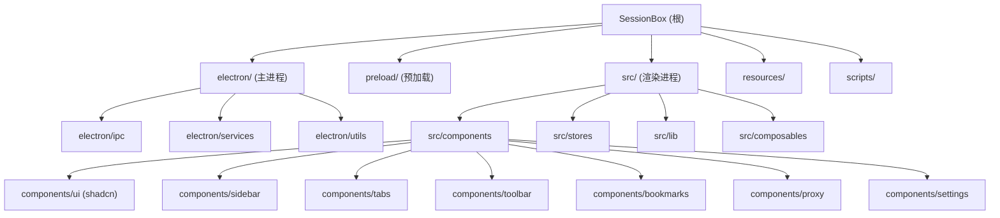

# SessionBox - AI 上下文文档

## 变更记录 (Changelog)

| 时间 | 操作 | 说明 |
|------|------|------|
| 2026-04-09 02:12:31 | 初始化 | 首次生成项目 AI 上下文，覆盖全部源码文件 |

---

## 项目愿景

SessionBox 是一个基于 Electron + Vue 3 的**多账号浏览器管理工具**。核心目标是让用户在同一个桌面应用内，通过 `partition` 隔离不同账号的 Cookie/Session，同时支持分组管理、代理配置、标签页拖拽排序、常用网站快捷访问等功能。典型使用场景包括：社交媒体多账号运营、电商多店铺管理、多身份浏览等。

---

## 架构总览

本项目采用经典的 **Electron 三进程架构**（主进程 / 预加载 / 渲染进程），构建工具链为 **electron-vite**。

- **主进程 (electron/)**：负责窗口管理、WebContentsView 生命周期、IPC 通信、数据持久化（electron-store）、代理配置、自定义协议（sessionbox://、account-icon://）
- **预加载 (preload/)**：通过 `contextBridge` 暴露类型安全的 IPC API 给渲染进程
- **渲染进程 (src/)**：Vue 3 + Pinia 状态管理 + Tailwind CSS 4 + Radix Vue/shadcn-vue 组件库

数据流向：渲染进程通过 `window.api.*` 调用 IPC -> 预加载桥接 -> 主进程处理 -> electron-store 持久化。主进程通过 `webContents.send` 向渲染进程推送事件（标题更新、URL 变化、导航状态等）。

---

## 模块结构图 (Mermaid)



---

## 模块索引

| 模块路径 | 语言 | 职责 | 入口文件 | 测试 | 文档 |
|----------|------|------|----------|------|------|
| `electron/` | TypeScript | 主进程：窗口、IPC、数据存储、WebView 管理、代理 | `electron/main.ts` | 无 | [CLAUDE.md](./electron/CLAUDE.md) |
| `preload/` | TypeScript | 预加载脚本：contextBridge 暴露 IPC API | `preload/index.ts` | 无 | [CLAUDE.md](./preload/CLAUDE.md) |
| `src/` | TypeScript + Vue | 渲染进程：UI 组件、Pinia 状态管理 | `src/main.ts` | 无 | [CLAUDE.md](./src/CLAUDE.md) |
| `scripts/` | JavaScript | 构建/打包脚本 | `scripts/build-production.js` | 无 | - |
| `resources/` | 静态资源 | 应用图标（PNG/ICNS） | - | - | - |

---

## 运行与开发

### 前置条件

- Node.js（推荐 LTS 版本）
- pnpm 包管理器

### 常用命令

```bash
# 开发模式（热重载）
pnpm dev

# 构建（编译主进程 + 预加载 + 渲染进程）
pnpm build

# 预览构建结果
pnpm preview

# 生产打包（含 electron-builder）
pnpm pack

# 仅打包目录（不生成安装包）
pnpm pack:dir
```

### 构建配置

- **Vite 配置**：`electron.vite.config.ts` -- 定义了 main/preload/renderer 三个构建入口
- **Electron Builder**：`electron-builder.json` -- 定义 DMG（Mac）/ NSIS（Windows）打包参数
- **TypeScript**：`tsconfig.json` + `tsconfig.node.json` + `tsconfig.web.json`

### 数据存储

- 使用 `electron-store` 将数据持久化为 JSON 文件，存储在用户数据目录
- 数据模型包括：`groups`、`accounts`、`proxies`、`tabs`、`bookmarks`
- 账号图标保存在 `{userData}/account-icons/` 目录

### 自定义协议

- `sessionbox://openAccount?id={accountId}` -- 深度链接，用于桌面快捷方式直接打开账号
- `account-icon://{filename}` -- 账号自定义图标加载协议

---

## 测试策略

当前项目**未配置测试框架**，无单元测试、集成测试或 E2E 测试文件。

---

## 编码规范

- **语言**：TypeScript（主进程/预加载/渲染进程均使用 TS）
- **UI 组件**：Vue 3 Composition API (`<script setup lang="ts">`)
- **样式**：Tailwind CSS 4 + CSS 变量主题系统（亮色/暗色双主题）
- **组件库**：基于 Radix Vue / reka-ui 的 shadcn-vue 组件
- **图标**：lucide-vue-next
- **状态管理**：Pinia（Composition API 风格）
- **IPC 通信**：通过 preload 桥接，类型定义在 `preload/index.ts`、`src/types/index.ts`、`electron/services/store.ts` 三处保持同步
- **拖拽排序**：vuedraggable 库

---

## AI 使用指引

### 项目结构导航

1. 需要修改 **UI 界面** -> 看 `src/components/` 和 `src/stores/`
2. 需要修改 **数据处理或持久化** -> 看 `electron/services/store.ts`
3. 需要修改 **IPC 通信接口** -> 同时修改 `preload/index.ts` 和 `electron/ipc/`
4. 需要修改 **WebView/标签页行为** -> 看 `electron/services/webview-manager.ts` 和 `src/stores/tab.ts`
5. 需要修改 **代理功能** -> 看 `electron/services/proxy.ts` 和 `electron/ipc/proxy.ts`
6. 需要添加 **新数据模型** -> 同步修改 `src/types/index.ts`、`electron/services/store.ts`、`preload/index.ts`

### 关键注意事项

- 数据模型类型在三处重复定义（渲染进程 types、主进程 store、预加载），修改时必须同步
- WebView 通过 `WebContentsView`（非 `<webview>` 标签）实现，由主进程管理生命周期
- 每个账号使用独立的 `persist:account-{id}` partition 进行 Session 隔离
- 代理支持热更新：修改代理后自动刷新所有使用该代理的标签页
- 窗口为无边框（`frame: false`），拖拽区域通过 CSS `-webkit-app-region: drag` 实现
