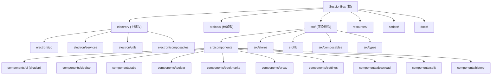

# SessionBox - AI 上下文文档

## 变更记录 (Changelog)

| 时间 | 操作 | 说明 |
|------|------|------|
| 2026-04-13 10:44:52 | 增量更新 | 全面更新文档：新增工作区/容器/页面模型、分屏、下载管理、扩展、自动更新、托盘、快捷键、书签导入导出/健康检查、主题预设、历史记录、Dexie 等 |
| 2026-04-09 02:12:31 | 初始化 | 首次生成项目 AI 上下文，覆盖全部源码文件 |

---

## 项目愿景

SessionBox 是一个基于 Electron + Vue 3 的**多账号浏览器管理工具**。核心目标是让用户在同一个桌面应用内，通过 `partition` 隔离不同账号的 Cookie/Session，同时支持分组管理、代理配置、标签页拖拽排序、常用网站快捷访问、分屏视图、Chrome 扩展、Aria2 下载管理等功能。典型使用场景包括：社交媒体多账号运营、电商多店铺管理、多身份浏览等。

---

## 架构总览

本项目采用经典的 **Electron 三进程架构**（主进程 / 预加载 / 渲染进程），构建工具链为 **electron-vite**。

- **主进程 (electron/)**：负责窗口管理、WebContentsView 生命周期、IPC 通信、数据持久化（electron-store）、代理配置、自定义协议、Chrome 扩展加载、Aria2 下载管理、系统托盘、自动更新、全局快捷键、标签冻结等
- **预加载 (preload/)**：通过 `contextBridge` 暴露类型安全的 IPC API 给渲染进程
- **渲染进程 (src/)**：Vue 3 + Pinia 状态管理 + Tailwind CSS 4 + Radix Vue/shadcn-vue 组件库 + Dexie(IndexedDB) 本地历史记录

数据流向：渲染进程通过 `window.api.*` 调用 IPC -> 预加载桥接 -> 主进程处理 -> electron-store 持久化。主进程通过 `webContents.send` 向渲染进程推送事件（标题更新、URL 变化、导航状态、代理信息、标签冻结等）。

---

## 模块结构图 (Mermaid)



---

## 模块索引

| 模块路径 | 语言 | 职责 | 入口文件 | 测试 | 文档 |
|----------|------|------|----------|------|------|
| `electron/` | TypeScript | 主进程：窗口、IPC、数据存储、WebView 管理、代理、扩展、下载、托盘、更新、快捷键 | `electron/main.ts` | 无 | [CLAUDE.md](./electron/CLAUDE.md) |
| `preload/` | TypeScript | 预加载脚本：contextBridge 暴露 IPC API | `preload/index.ts` | 无 | [CLAUDE.md](./preload/CLAUDE.md) |
| `src/` | TypeScript + Vue | 渲染进程：UI 组件、Pinia 状态管理、Dexie 历史记录 | `src/main.ts` | 无 | [CLAUDE.md](./src/CLAUDE.md) |
| `scripts/` | JavaScript | 构建/打包脚本 | `scripts/build-production.js` | 无 | - |
| `resources/` | 静态资源 | 应用图标（PNG/ICNS）、托盘图标 | - | - | - |
| `docs/` | Markdown | 设计文档、功能规划 | - | - | - |

---

## 运行与开发

### 前置条件

- Node.js（推荐 LTS 版本）
- pnpm 包管理器

### 常用命令

```bash
# 开发模式（热重载）
pnpm dev

# 构建（编译主进程 + 预加载 + 渲染进程）
pnpm build

# 预览构建结果
pnpm preview

# 生产打包（含 electron-builder）
pnpm pack

# 仅打包目录（不生成安装包）
pnpm pack:dir
```

### 构建配置

- **Vite 配置**：`electron.vite.config.ts` -- 定义了 main/preload/renderer 三个构建入口
- **Electron Builder**：`electron-builder.json` -- 定义 DMG（Mac）/ NSIS（Windows）打包参数
- **TypeScript**：`tsconfig.json` + `tsconfig.node.json` + `tsconfig.web.json`

### 数据存储

- **electron-store**：将结构化数据持久化为 JSON 文件，存储在用户数据目录
  - 核心数据模型：`workspaces`、`groups`、`containers`、`pages`、`proxies`、`tabs`、`bookmarks`、`bookmarkFolders`、`extensions`、`containerExtensions`
  - 配置数据：`windowState`、`tabFreezeMinutes`、`shortcuts`、`mutedSites`、`splitStates`、`splitSchemes`、`trayWindowSizes`
- **Dexie (IndexedDB)**：浏览历史记录（`sessionbox-history` 数据库），最多 10000 条
- **localStorage**：主题、工作区视图、标签栏布局、主页设置、用户头像等轻量配置
- 账号图标保存在 `{userData}/account-icons/` 目录
- 容器图标保存在 `{userData}/container-icons/` 目录

### 自定义协议

- `sessionbox://openContainer?id={containerId}` -- 深度链接，用于桌面快捷方式直接打开页面
- `account-icon://{filename}` -- 账号自定义图标加载协议
- `extension-icon://{extensionId}` -- 扩展图标加载协议

### 默认浏览器功能

- 支持注册为系统默认浏览器（http/https 协议处理器）
- 外部 http/https 链接会在主窗口当前标签页中打开

---

## 测试策略

当前项目**未配置测试框架**，无单元测试、集成测试或 E2E 测试文件。

---

## 编码规范

- **语言**：TypeScript（主进程/预加载/渲染进程均使用 TS）
- **UI 组件**：Vue 3 Composition API (`<script setup lang="ts">`)
- **样式**：Tailwind CSS 4 + CSS 变量主题系统（6 种预设主题：默认/Apple/Google/Tesla/Spotify/NVIDIA）
- **组件库**：基于 Radix Vue / reka-ui 的 shadcn-vue 组件
- **图标**：lucide-vue-next（含动态图标解析器 `lucide-resolver.ts`）
- **状态管理**：Pinia（Composition API 风格），14 个 Store
- **本地数据库**：Dexie (IndexedDB) 用于浏览历史
- **IPC 通信**：通过 preload 桥接，类型定义在 `preload/index.ts`、`src/types/index.ts`、`electron/services/store.ts` 三处保持同步
- **拖拽排序**：vuedraggable 库（分组/标签页）+ 自定义拖拽协议（书签文件夹/书签）
- **下载管理**：Aria2 RPC 通信，内置 aria2c 二进制（Windows）
- **扩展管理**：electron-chrome-extensions 库，按 partition 隔离加载

---

## AI 使用指引

### 项目结构导航

1. 需要修改 **UI 界面** -> 看 `src/components/` 和 `src/stores/`
2. 需要修改 **数据处理或持久化** -> 看 `electron/services/store.ts`
3. 需要修改 **IPC 通信接口** -> 同时修改 `preload/index.ts`、`electron/ipc/`、`src/types/index.ts`
4. 需要修改 **WebView/标签页行为** -> 看 `electron/services/webview-manager.ts` 和 `src/stores/tab.ts`
5. 需要修改 **代理功能** -> 看 `electron/services/proxy.ts` 和 `electron/ipc/proxy.ts`
6. 需要添加 **新数据模型** -> 同步修改 `src/types/index.ts`、`electron/services/store.ts`、`preload/index.ts`
7. 需要修改 **分屏功能** -> 看 `src/stores/split.ts`、`src/lib/split-layout.ts`、`electron/ipc/split.ts`
8. 需要修改 **下载功能** -> 看 `electron/services/aria2.ts`、`electron/ipc/download.ts`、`src/stores/download.ts`
9. 需要修改 **扩展功能** -> 看 `electron/services/extensions.ts`、`electron/ipc/extensions.ts`
10. 需要修改 **托盘功能** -> 看 `electron/services/tray.ts`、`electron/services/tray-window.ts`
11. 需要修改 **快捷键** -> 看 `electron/services/shortcut-manager.ts`、`src/stores/shortcut.ts`
12. 需要修改 **历史记录** -> 看 `src/lib/db.ts`、`src/stores/history.ts`

### 关键注意事项

- **数据模型三处同步**：`src/types/index.ts`、`electron/services/store.ts`、`preload/index.ts` 的类型定义必须保持一致，修改时必须同步
- **WebView 通过 WebContentsView 实现**：由主进程管理生命周期，不是 `<webview>` 标签
- **Partition 隔离**：每个容器使用独立的 `persist:container-{id}` partition
- **代理热更新**：修改代理后自动刷新所有使用该代理的标签页
- **标签冻结**：后台标签超时可自动冻结（销毁 WebContentsView 但保留数据），激活时按需重建
- **下载拦截**：Aria2 启用时，通过 session 的 `will-download` 事件拦截 WebView 下载
- **扩展按 Partition 隔离**：每个 container partition 独立管理 Chrome 扩展实例
- **窗口为无边框**（`frame: false`），拖拽区域通过 CSS `-webkit-app-region: drag` 实现
- **关闭窗口不退出**：窗口关闭时隐藏到托盘，通过托盘菜单真正退出
- **内部页面**：`sessionbox://bookmarks`、`sessionbox://history`、`sessionbox://downloads` 等内部页面在渲染进程中渲染，不走 WebContentsView
- **数据迁移**：启动时自动执行 Container -> Page 迁移、旧 Bookmark 格式迁移

### 核心数据模型关系

```
Workspace (工作区)
  -> Group (分组，属于某个工作区)
    -> Page (页面，属于某个分组，绑定容器)
      -> Container (容器，Session 隔离单元，可绑定代理)
      -> Tab (标签页，运行时关联页面)

Proxy (代理配置，可绑定到分组/容器/页面)
BookmarkFolder (书签文件夹，树形结构)
  -> Bookmark (书签)
Extension (Chrome 扩展，按容器加载)
```
