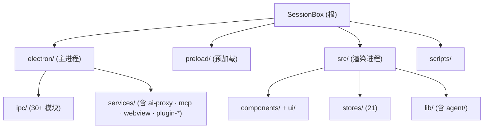

# SessionBox

## 项目简介

SessionBox 是一个基于 **Electron + Vue 3** 的**多账号浏览器管理桌面应用**。通过 `partition` 隔离不同账号的 Cookie/Session，支持分组管理、代理配置、标签页拖拽排序、分屏、Aria2 下载、Chrome 扩展、AI 智能助手（Agent/Chat）、MCP Server、插件系统、rrweb 调试器与操作录制回放等。

典型场景：社交媒体多账号运营、电商多店铺管理、多身份浏览、浏览器自动化。

技术栈：Electron 38（三进程）+ electron-vite 构建 + Vue 3 + Pinia（21 Store）+ Tailwind CSS 4 + shadcn-vue(Radix/reka) + Dexie(IndexedDB) + electron-store/JsonStore 持久化。

## 约定的规则（高优先级）

- 语言全栈 TypeScript；Vue 用 `<script setup lang="ts">`。包管理器固定 **pnpm@10.17.1**。
- 命令：`pnpm dev`（开发）/ `pnpm build`（构建）/ `pnpm pack`（打包）。**无测试命令、无 lint 脚本。**
- **数据模型三处同步**：`src/types/index.ts` ↔ `electron/services/store.ts` ↔ `preload/index.ts`。
- **IPC 三处同步**：`preload/index.ts` ↔ `electron/ipc/*` ↔ `src/types/index.ts`。
- **WebView = WebContentsView**（非 `<webview>` 标签），逻辑在 `electron/services/webview-manager.ts` + `electron/services/webview/`。
- 窗口**无边框透明**（`frame:false, transparent:true`），拖拽靠 CSS；关闭行为由 `minimizeOnClose` 决定。
- AI API Key **仅在主进程** `ai-proxy` 组装，不进入渲染进程。
- 不主动执行 git。

> 更多约定（ESLint 规则、代码风格、设计规范）见 [claude/conventions.md](claude/conventions.md)。

## 文件索引

| 文件 | 用途 | 何时阅读 |
|------|------|----------|
| [claude/overview.md](claude/overview.md) | 架构总览、三进程、数据流、设计取舍 | 了解全局时 |
| [claude/conventions.md](claude/conventions.md) | 命令、代码风格、ESLint、设计规范 | 写代码前 |
| [claude/module-responsibilities.md](claude/module-responsibilities.md) | 模块职责与子域划分 | 定位目录时 |
| [claude/entrypoints.md](claude/entrypoints.md) | 入口文件、构建配置、启动序列 | 调启动/构建时 |
| [claude/public-interfaces.md](claude/public-interfaces.md) | 自定义协议、默认浏览器、MCP 端点 | 对外接口时 |
| [claude/dependencies-and-config.md](claude/dependencies-and-config.md) | 依赖、配置文件、环境 | 配置/升级时 |
| [claude/data-model.md](claude/data-model.md) | 领域模型关系、四层持久化 | 改数据时 |
| [claude/testing-and-quality.md](claude/testing-and-quality.md) | 测试现状、Lint、质量风险 | 评估质量时 |
| [claude/file-map.md](claude/file-map.md) | 根目录文件与目录地图 | 找文件时 |
| [claude/faq.md](claude/faq.md) | "改 X 看 Y"导航、关键注意、已知不一致 | 排错/定位时 |
| [claude/changelog.md](claude/changelog.md) | 索引变更记录（最近 5 条） | 查文档历史时 |

## 模块索引

| 模块路径 | 职责摘要 | 文档 |
|----------|----------|------|
| `electron/` | 主进程：窗口、WebContentsView、IPC（30+）、持久化、代理、扩展、下载、托盘、更新、快捷键、AI 代理、MCP、插件、调试器 | [electron/CLAUDE.md](electron/CLAUDE.md) |
| `preload/` | 预加载：`contextBridge` 暴露 `window.api`（32 命名空间） | [preload/CLAUDE.md](preload/CLAUDE.md) |
| `src/` | 渲染进程：Vue UI、Pinia（21 Store）、AI Agent、Dexie 历史/聊天 | [src/CLAUDE.md](src/CLAUDE.md) |
| `scripts/` | 构建打包脚本、插件构建/服务器 | — |
| `resources/` `docs/` `plugins/` | 图标 / 设计文档 / 示例插件 | — |

### 模块结构图

```mermaid
graph TD
    ROOT["SessionBox (根)"] --> ELECTRON["electron/ (主进程)"]
    ROOT --> PRELOAD["preload/ (预加载)"]
    ROOT --> SRC["src/ (渲染进程)"]
    ROOT --> SCRIPTS["scripts/"]
    ELECTRON --> EI["ipc/ (30+ 模块)"]
    ELECTRON --> ES["services/ (含 ai-proxy · mcp · webview · plugin-*)"]
    SRC --> SC["components/ + ui/"]
    SRC --> SS["stores/ (21)"]
    SRC --> SLIB["lib/ (含 agent/)"]
    click ELECTRON "./electron/CLAUDE.md"
    click PRELOAD "./preload/CLAUDE.md"
    click SRC "./src/CLAUDE.md"
```

## 扫描状态

- 更新时间：2026-07-29 15:39（本地）
- 已扫描：根、electron（主进程含 services/ipc/utils/composables + 调试器）、preload、src（渲染进程全部结构与关键文件）。
- 跳过：`node_modules/`、`out/`、`dist-app/`、`build/`、平台 `*_packages/` 二进制。
- 已纠正：旧文档的工作流 UI/store/preload 命名空间已移除；补录调试器/操作录制、webview 子模块、store.ts 完整 schema。
- 建议下一步深挖：`src/components/**` 单组件（250+ .vue）、`docs/superpowers/**` 设计文档、`scripts/` 与 `plugins/` 细节。
